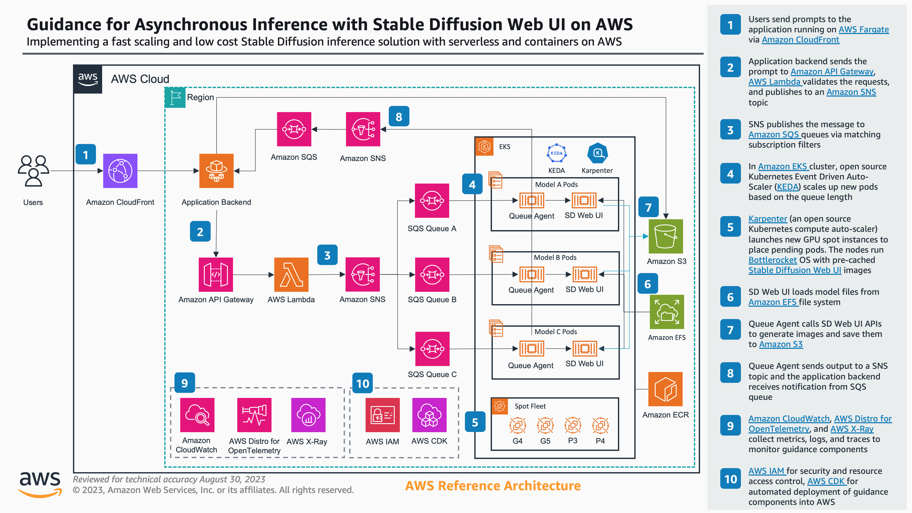

# Guidance for Asynchronous Inference with Stable Diffusion Web UI on AWS

Implementing a fast scaling and low cost Stable Diffusion inference solution with serverless and containers on AWS

[AUTOMATIC1111 Stable Diffusion Web UI](https://github.com/AUTOMATIC1111/stable-diffusion-webui) is a popular open source project for generating images using Gen AI. Building a scalable and cost efficient inference solution is a common challenge AWS customers facing. This guidance shows how to use serverless and container services, such as Amazon API Gateway, AWS Lambda, Amazon SNS, Amazon SQS, and Amazon EKS to build an end-to-end low cost and fast scaling asyncronous image generation architecture. This repo contains the sample code and CDK deployment scripts, helping customers to deploy this solution in a few steps.

## Features

- Asyncronous API and Serverless Event-Driven Architecture
- Image Generation with Stable Diffusion Web UI on Amazon EKS
- Automatic queue length based scaling with KEDA
- Automatic provisioning ec2 instances with Karpenter
- Scaling up new inference nodes within 2 minutes
- Saving up to 70% with GPU spot instances

## Documentations

- [QuickStart](docs/quickstart.md)
- [Configuration](docs/configuration.md)
- [Development](docs/development.md)

## Security

See [CONTRIBUTING](CONTRIBUTING.md#security-issue-notifications) for more information.

## License

This library is licensed under Apache License Version 2.0. See the [LICENSE](LICENSE) file.
